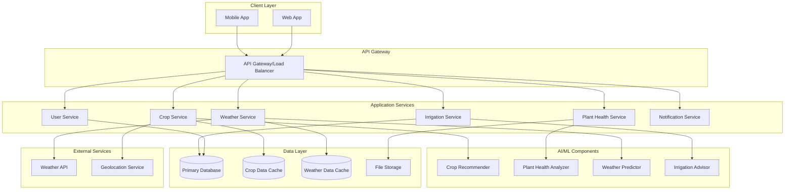
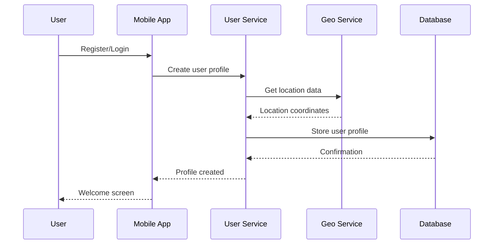
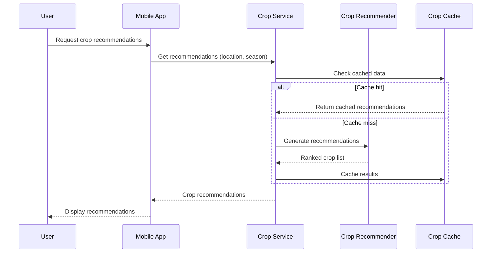
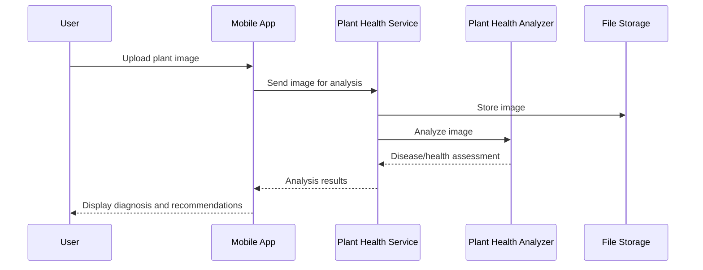

# Design Document: AI-Powered Farming Assistant

## Overview

The AI-powered farming assistant is a mobile-first decision support system designed for hobbyist and small-scale farmers in semi-urban India. The system leverages machine learning for crop recommendations, plant health analysis, and irrigation optimization while maintaining affordability and accessibility through efficient architecture and offline capabilities.

## Architecture

### High-Level Architecture



### Component Breakdown

**Client Layer:**
- Progressive Web App (PWA) for cross-platform compatibility
- Offline-first architecture with local caching
- Responsive design optimized for low-end Android devices

**API Gateway:**
- Request routing and load balancing
- Authentication and rate limiting
- API versioning and documentation

**Application Services:**
- Microservices architecture for scalability
- RESTful APIs with JSON responses
- Service-to-service communication via HTTP/gRPC

**AI/ML Components:**
- Lightweight models optimized for cloud inference
- Batch processing for non-real-time recommendations
- Model versioning and A/B testing capabilities

## AI/ML Components

### Crop Recommender
- **Algorithm**: Collaborative filtering + content-based filtering
- **Features**: Location (lat/long), season, soil type, historical yield data
- **Model**: Gradient boosting (XGBoost) for ranking suitable crops
- **Training Data**: Government agricultural datasets, regional crop success rates
- **Output**: Ranked list of crops with success probability scores

### Plant Health Analyzer
- **Algorithm**: Convolutional Neural Network (CNN) for image classification
- **Architecture**: MobileNetV3 for mobile optimization
- **Classes**: 20 common diseases/pests + healthy state
- **Fallback**: Rule-based system for text symptom analysis
- **Training Data**: PlantVillage dataset + regional disease images
- **Output**: Disease/pest identification with confidence score and treatment recommendations

### Weather Predictor
- **Algorithm**: Time series forecasting (LSTM/Prophet)
- **Features**: Historical weather patterns, seasonal trends, location
- **Integration**: Primary data from external weather APIs
- **Fallback**: Historical averages when API unavailable
- **Output**: 7-day forecast with farming-specific insights

### Irrigation Advisor
- **Algorithm**: Rule-based system with ML optimization
- **Features**: Soil moisture, crop type, growth stage, weather forecast
- **Model**: Decision tree for water requirement calculation
- **Training Data**: Crop water requirement databases, soil moisture patterns
- **Output**: Watering schedule with quantity and timing recommendations

## Data Flow

### User Registration and Onboarding


### Crop Recommendation Flow


### Plant Health Analysis Flow


## User Interaction Flow

### Primary User Journey
1. **Onboarding**: Location setup, language selection, farm profile creation
2. **Dashboard**: Weather overview, urgent alerts, quick actions
3. **Crop Planning**: Seasonal recommendations, planting calendar
4. **Daily Operations**: Irrigation reminders, health monitoring, weather updates
5. **Problem Resolution**: Plant health diagnosis, treatment guidance

### Interface Design Principles
- **Visual-first**: Icons and images over text
- **Progressive disclosure**: Simple options first, details on demand
- **Offline-capable**: Core features work without internet
- **Voice-friendly**: Support for voice commands in local languages
- **Low-bandwidth**: Optimized for 2G/3G networks

## Data Models

### User Profile
```json
{
  "userId": "string",
  "location": {
    "latitude": "number",
    "longitude": "number",
    "district": "string",
    "state": "string"
  },
  "preferences": {
    "language": "string",
    "units": "metric|imperial",
    "notifications": "boolean"
  },
  "farmProfile": {
    "farmSize": "number",
    "soilType": "string",
    "irrigationType": "string",
    "currentCrops": ["string"]
  }
}
```

### Crop Recommendation
```json
{
  "cropId": "string",
  "cropName": "string",
  "localName": "string",
  "successProbability": "number",
  "expectedYield": "number",
  "growingPeriod": "number",
  "waterRequirement": "string",
  "seasonalTiming": {
    "plantingStart": "date",
    "plantingEnd": "date",
    "harvestStart": "date",
    "harvestEnd": "date"
  }
}
```

### Plant Health Assessment
```json
{
  "assessmentId": "string",
  "imageUrl": "string",
  "diagnosis": {
    "condition": "string",
    "confidence": "number",
    "severity": "low|medium|high"
  },
  "recommendations": [
    {
      "treatment": "string",
      "priority": "number",
      "cost": "string",
      "availability": "string"
    }
  ]
}
```

## Correctness Properties

*A property is a characteristic or behavior that should hold true across all valid executions of a system—essentially, a formal statement about what the system should do. Properties serve as the bridge between human-readable specifications and machine-verifiable correctness guarantees.*

Before defining the correctness properties, I need to analyze the acceptance criteria from the requirements document to determine which ones are testable as properties.

### Property 1: Crop Recommendation Validity
*For any* valid location and season combination, all returned crop recommendations should be suitable for that specific location and season according to the crop database.
**Validates: Requirements 1.1**

### Property 2: Recommendation Completeness
*For any* system recommendation (crop, irrigation, or health), the response should contain all required fields including relevant metrics, timing information, and actionable guidance.
**Validates: Requirements 1.2, 2.3, 3.3**

### Property 3: Recommendation Optimization
*For any* set of multiple suitable options, recommendations should be ranked by success probability, prioritize cost-effectiveness and local availability, and apply appropriate conservation strategies when environmental constraints exist.
**Validates: Requirements 1.3, 2.4, 8.4**

### Property 4: Weather-Responsive Behavior
*For any* weather forecast data, the system should adjust irrigation recommendations appropriately (reducing watering when rain is predicted, suggesting protective measures for extreme conditions).
**Validates: Requirements 2.5, 4.3, 4.4**

### Property 5: Plant Health Analysis Consistency
*For any* plant health analysis request, the system should provide disease/pest identification and incorporate regional disease patterns and seasonal factors in the analysis.
**Validates: Requirements 3.1, 3.5**

### Property 6: Alert System Reliability
*For any* severe weather condition, the system should send immediate alerts to all users in the affected geographic area.
**Validates: Requirements 4.1**

### Property 7: Weather-Based Recommendations
*For any* daily weather update, the system should generate farming-specific recommendations relevant to the current weather conditions.
**Validates: Requirements 4.2**

### Property 8: Language Functionality
*For any* supported language selection, all system content should be displayed in that language and voice commands should be recognized in that language.
**Validates: Requirements 5.2, 5.5**

### Property 9: Session Preservation
*For any* language switch operation, user data and current session state should remain intact and accessible.
**Validates: Requirements 5.3**

### Property 10: Offline Capability
*For any* poor connectivity scenario, the system should provide cached recommendations and maintain core functionality without internet access.
**Validates: Requirements 6.2**

### Property 11: Decision Simplification
*For any* complex decision scenario, the system should break it down into a series of simple yes/no questions or binary choices.
**Validates: Requirements 6.4**

### Property 12: Data Security and Privacy
*For any* user data provided to the system, it should be encrypted in storage and anonymized when used for system improvement purposes.
**Validates: Requirements 7.1, 7.4**

### Property 13: Data Deletion Compliance
*For any* user data deletion request, all personal information should be completely removed from the system within the specified timeframe.
**Validates: Requirements 7.3**

### Property 14: Free Tier Functionality
*For any* core farming functionality, it should remain accessible without requiring premium features or paid upgrades.
**Validates: Requirements 8.2**

## Error Handling

### Client-Side Error Handling
- **Network Failures**: Graceful degradation to cached data with user notification
- **Invalid Input**: Input validation with helpful error messages in user's language
- **Image Processing Failures**: Fallback to text-based symptom analysis
- **Location Errors**: Manual location input option with district/state selection

### Server-Side Error Handling
- **External API Failures**: Fallback to cached weather data or historical averages
- **ML Model Failures**: Fallback to rule-based recommendations with reduced confidence
- **Database Errors**: Retry logic with exponential backoff and circuit breaker pattern
- **Rate Limiting**: Queue management with priority for critical alerts

### Data Quality Issues
- **Incomplete Weather Data**: Use regional averages and historical patterns
- **Poor Image Quality**: Request image retake with guidance for better photos
- **Invalid Location Data**: Prompt for manual location verification
- **Inconsistent User Input**: Data validation with suggested corrections

## Testing Strategy

### Dual Testing Approach
The system will employ both unit testing and property-based testing to ensure comprehensive coverage:

**Unit Tests:**
- Specific examples demonstrating correct behavior for each component
- Edge cases and error conditions (poor connectivity, missing data, invalid inputs)
- Integration points between services and external APIs
- Authentication and authorization flows
- Data validation and sanitization

**Property-Based Tests:**
- Universal properties that hold across all valid inputs
- Comprehensive input coverage through randomization
- Each property test will run minimum 100 iterations
- Tests will be tagged with format: **Feature: ai-farming-assistant, Property {number}: {property_text}**

### Testing Configuration
- **Framework**: Jest for JavaScript/TypeScript with fast-check for property-based testing
- **Coverage**: Minimum 80% code coverage for all services
- **Performance**: Response time testing for mobile network conditions
- **Security**: Penetration testing for data protection and privacy compliance
- **Accessibility**: Testing across different devices and network conditions

### Property Test Implementation
Each correctness property will be implemented as a single property-based test that:
- Generates random valid inputs within the domain constraints
- Executes the system behavior being tested
- Verifies the property holds true for all generated inputs
- References the corresponding design document property in test comments

## Deployment Assumptions

### Infrastructure Requirements
- **Cloud Platform**: AWS or Google Cloud with auto-scaling capabilities
- **Database**: PostgreSQL for transactional data, Redis for caching
- **File Storage**: S3-compatible storage for images and model artifacts
- **CDN**: CloudFront or equivalent for static asset delivery
- **Monitoring**: Application performance monitoring and logging

### Scalability Considerations
- **Horizontal Scaling**: Stateless microservices with load balancing
- **Database Scaling**: Read replicas and connection pooling
- **Caching Strategy**: Multi-level caching (CDN, application, database)
- **ML Model Serving**: Containerized models with auto-scaling based on demand
- **Geographic Distribution**: Regional deployments for reduced latency

### Security and Compliance
- **Data Encryption**: TLS 1.3 for data in transit, AES-256 for data at rest
- **Authentication**: JWT tokens with refresh token rotation
- **API Security**: Rate limiting, input validation, and CORS policies
- **Privacy Compliance**: GDPR-compliant data handling and user consent management
- **Audit Logging**: Comprehensive logging for security and compliance monitoring

### Performance Targets
- **Response Time**: <2 seconds for recommendations, <5 seconds for image analysis
- **Availability**: 99.5% uptime with graceful degradation during outages
- **Throughput**: Support for 10,000 concurrent users with auto-scaling
- **Data Usage**: <1MB per session for mobile optimization
- **Offline Capability**: 7-day cache retention for core functionality
